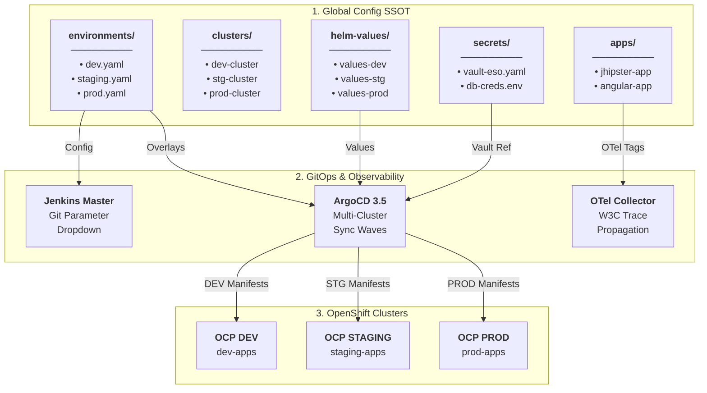

# 🌐 Centralized Global Configuration & Multi-Cluster GitOps SSOT

[](#)
[](#)
[](https://opentelemetry.io/)
[](https://argo-cd.readthedocs.io/)
[](https://www.redhat.com/openshift)
[](https://kubernetes.io/)
[](https://plugins.jenkins.io/git-parameter/)
[](https://external-secrets.io/)
[](https://12factor.net/)
[](LICENSE)

Centralized Single Source of Truth (SSOT) repository storing environment configurations, cluster topologies, application profiles, Helm values, and observability settings for cloud-native microservices on **Red Hat OpenShift 4.20+**.

---

> [!IMPORTANT]
> ### ⚠️ Architectural Blueprint & Sovereign Environment Notice
> - **Non-Production Testing Status**: This repository serves as an **architectural reference blueprint, educational design pattern, and foundational boilerplate**. It has **not been tested or executed in a live production environment**.
> - **Sovereign & Air-Gapped Boilerplate**: This project is engineered as a deterministic, version-controlled Infrastructure-as-Code (IaC) template that can be safely used as a **standardized boilerplate in enterprise environments where Agentic AI / LLMs are prohibited** due to data sovereignty, compliance regulations, intellectual property protection, or air-gapped security policies.
> - **Enterprise Hardening**: Platform engineers must review, adapt, and validate all cluster endpoints, TLS certificates, HashiCorp Vault configurations, OpenTelemetry collectors, and RBAC quotas prior to production adoption.
> - **AI Model Attribution & Review**: Originally generated using **Gemini 3.7 Flash** with **Antigravity**, subsequently audited, verified, and hardened using **Gemini 3.8 Flash**.
> - **Origin & Real-World Heritage**: This blueprint draws directly from the author's personal hands-on experience designing and operating enterprise integration platforms with these exact requirements (engineered just before agentic AI became widespread).

> [!TIP]
> ### 🚀 Companion Repository (CI/CD & GitOps Orchestration Platform)
> This configuration SSOT is consumed directly by the orchestration platform:  
> 🚀 **[nubenetes/jenkins-git-parameter](https://github.com/nubenetes/jenkins-git-parameter)**  
> *(Contains Jenkins JCasC, Job DSL multi-remote pipelines, OpenTelemetry collector integration, Grafana 13.2.0, ArgoCD 3.5, and Argo Rollouts Canary)*

---

## 🏛️ SSOT Configuration Hierarchy

<details open>
<summary>🗺️ <b>Click to expand: SSOT Configuration Hierarchy & Multi-Cluster Mapping Diagram</b></summary>
<br/>



</details>

---

## 🏗️ Repository Structure

```
jenkins-git-parameter-global-vars/
├── README.md                            # Documentation & usage patterns
├── environments/                        # Environment-specific configuration overlays
│   ├── dev.yaml                         # DEV configuration & application image versions
│   ├── staging.yaml                     # STAGING / UAT configuration
│   └── prod.yaml                        # PRODUCTION high-availability configuration
├── clusters/                            # OpenShift Cluster Topology Definitions
│   ├── ocp-dev-cluster.yaml             # Primary OCP DEV cluster (Control Plane & Workloads)
│   ├── ocp-staging-cluster.yaml         # OCP STAGING cluster (UAT & Pre-prod)
│   └── ocp-prod-cluster.yaml            # OCP PRODUCTION cluster (Multi-AZ High Availability)
├── apps/                                # Application metadata & inventory
│   ├── applications-inventory.yaml      # Master inventory of platform services
│   ├── jhipster-microservice.yaml       # Backend Java 21 Spring Boot config
│   └── angular-frontend.yaml            # Frontend Angular 18 config
├── helm-values/                         # Centralized Helm value files per service & environment
│   ├── jhipster-microservice/
│   │   ├── values-dev.yaml
│   │   ├── values-staging.yaml
│   │   └── values-prod.yaml
│   └── angular-frontend/
│       ├── values-dev.yaml
│       ├── values-staging.yaml
│       └── values-prod.yaml
├── secrets/                             # External Secrets Operator (ESO) custom resources
│   ├── external-secrets-dev.yaml
│   └── external-secrets-prod.yaml
└── secrets-templates/                   # Sanitized credential templates
    └── database-credentials.env
```

---

## 🎯 Architecture & Governance Patterns

1. **12-Factor Configuration Externalization**:
   Application container images remain strictly immutable across environments (`dev` -> `staging` -> `prod`). All environmental settings, database connection URLs, replica counts, and ingress hosts reside in this repository and are bound at deployment time via Helm values and ConfigMaps.

2. **Multi-Cluster Capacity Governance (No Pod CPU Limits)**:
   - **Pod Level**: `requests.cpu` is set explicitly for scheduling guarantees and CFS shares. CPU limits (`limits.cpu`) are **deliberately omitted** to eliminate Linux CFS Bandwidth Throttling during multi-threaded JVM garbage collection and burst traffic.
   - **Namespace Level**: Cluster CPU and Memory consumption are strictly bounded at the OpenShift Project boundary using native `ResourceQuota` manifests.

3. **Zero-Trust Secret Management**:
   Plaintext secrets are never stored in Git. Instead, [`secrets/`](secrets/) contains `ExternalSecret` custom resources that declare references to HashiCorp Vault paths, dynamically synced by the External Secrets Operator (ESO) into native Kubernetes Secrets in memory.

---

## 🔄 How It Integrates with `jenkins-git-parameter`

1. **Dynamic Parameter Resolution**: The Jenkins pipeline `02-CD-Release-Orchestrators/multi-cluster-release-orchestrator` uses the `git-parameter` plugin pointing directly to this repository (`https://github.com/nubenetes/jenkins-git-parameter-global-vars.git`).
2. **Interactive Selection**: When operators trigger releases in Jenkins, they can dynamically select any Git branch (e.g. `main`, `feature/database-v2`, `env/staging-override`) or Git release tag (e.g. `v2.1.0-release`, `v2.0.8-prod`).
3. **Automated Promotion**: Jenkins pulls the selected version, updates the target environment YAML / Helm values, and syncs ArgoCD 3.5 across the target OpenShift cluster using Sync Waves.

---

## 🌿 Branching & Tagging Strategy

| Branch / Tag Pattern | Purpose | Target Environment |
| :--- | :--- | :--- |
| `main` | Production-ready baseline | DEV / STAGING / PROD |
| `env/staging-override` | Temporary UAT parameter overrides | STAGING |
| `feature/*` | Experimental environment configurations | DEV |
| `v*.*.*-release` | Immutable signed production releases | PROD |
| `hotfix-*` | Fast-track emergency configurations | PROD |

---

## 🔗 Related Repositories

- 🚀 **Main Orchestration Platform**: [nubenetes/jenkins-git-parameter](https://github.com/nubenetes/jenkins-git-parameter)
- ☕ **Backend Microservice PoC**: [nubenetes/jhipster-microservice](https://github.com/nubenetes/jhipster-microservice)
- 🌐 **TIBCO BWCE SSOT Companion**: [nubenetes/jenkins-git-parameter-bwce-global-vars](https://github.com/nubenetes/jenkins-git-parameter-bwce-global-vars)
- 📦 **TIBCO BWCE Platform Orchestrator**: [nubenetes/jenkins-git-parameter-bwce](https://github.com/nubenetes/jenkins-git-parameter-bwce)
